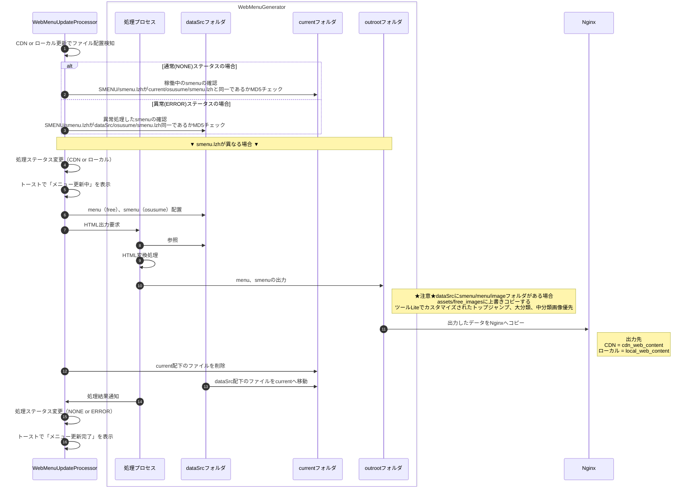

```mermaid
sequenceDiagram
    autonumber

    participant parent as WebMenuUpdateProcessor
    box WebMenuGenerator
        participant generator as 処理プロセス
        participant dataSrc as dataSrcフォルダ
        participant current as currentフォルダ
        participant outroot as outrootフォルダ
    end
    participant Nginx as Nginx

    parent->>parent: CDN or ローカル更新でファイル配置検知

    alt 通常(NONE)ステータスの場合
        parent->>current: 稼働中のsmenuの確認<br>SMENU/smenu.lzhがcurrent/osusume/smenu.lzhと同一であるかMD5チェック
    else 異常(ERROR)ステータスの場合
        parent->>dataSrc: 異常処理したsmenuの確認<br>SMENU/smenu.lzhがdataSrc/osusume/smenu.lzh同一であるかMD5チェック 
    end

    Note over parent,outroot: ▼ smenu.lzhが異なる場合 ▼

    parent->>parent: 処理ステータス変更（CDN or ローカル）
    parent->>parent: トーストで「メニュー更新中」を表示

    parent->>dataSrc: menu（free）、smenu（osusume）配置
    parent->>generator: HTML出力要求
    generator->>dataSrc: 参照
    generator->>generator: HTML変換処理
    generator->>outroot: menu、smenuの出力
    Note right of outroot: ★注意★dataSrcにsmenu/menu/imageフォルダがある場合<br/>assets/free_imagesに上書きコピーする<br/>ツールLiteでカスタマイズされたトップジャンプ、大分類、中分類画像優先

    outroot->>Nginx: 出力したデータをNginxへコピー
    Note right of Nginx: 出力先<br>CDN = cdn_web_content<br>ローカル = local_web_content 

    parent->>current: current配下のファイルを削除
    dataSrc->>current: dataSrc配下のファイルをcurrentへ移動 

    generator->>parent: 処理結果通知
    parent->>parent: 処理ステータス変更（NONE or ERROR）
    parent->>parent: トーストで「メニュー更新完了」を表示

```