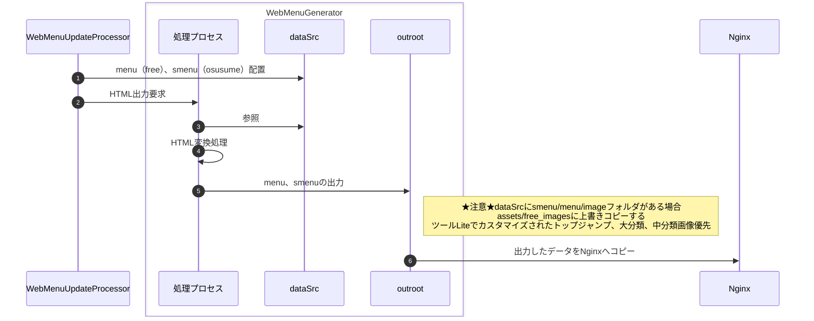

```mermaid
sequenceDiagram
    autonumber

    participant parent as WebMenuUpdateProcessor
    box WebMenuGenerator
        participant generator as 処理プロセス
        participant dataSrc as dataSrc
        participant outroot as outroot
    end
    participant Nginx as Nginx

    parent->>dataSrc: menu（free）、smenu（osusume）配置
    parent->>generator: HTML出力要求
    generator->>dataSrc: 参照
    generator->>generator: HTML変換処理
    generator->>outroot: menu、smenuの出力
    Note right of outroot: ★注意★dataSrcにsmenu/menu/imageフォルダがある場合<br/>assets/free_imagesに上書きコピーする<br/>ツールLiteでカスタマイズされたトップジャンプ、大分類、中分類画像優先

    outroot->>Nginx: 出力したデータをNginxへコピー


```